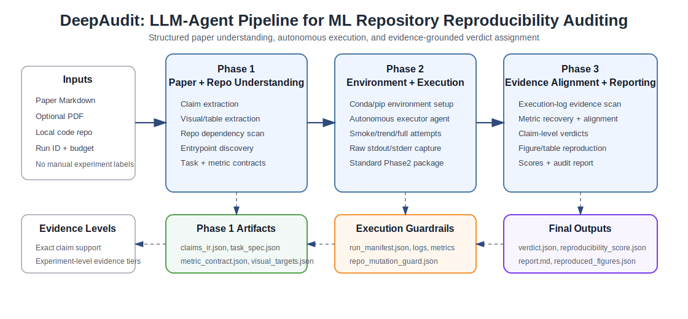

# 3 DeepAudit Method

DeepAudit audits whether the experimental claims in a machine-learning paper can be reproduced from its companion repository. The system takes three inputs: a paper converted to Markdown, the original PDF when available for visual and table extraction, and a local clone of the code repository. It writes all intermediate and final outputs to a run-specific artifact directory. The pipeline has three stages: paper and repository understanding, environment setup and autonomous execution, and evidence alignment with verdict assignment.

**Figure 1.** Overview of the DeepAudit pipeline. Phase 1 extracts claims, figures, tables, repository entrypoints, and metric contracts. Phase 2 constructs an execution environment and runs repository experiments through an autonomous executor. Phase 3 recovers metrics from execution artifacts, aligns evidence to paper claims, generates reproduced visual comparisons, and emits verdicts and scores.

## 3.1 Problem Setting and Inputs

Given a paper-code pair, DeepAudit aims to answer two related but distinct questions. First, can the repository be configured and executed in a way that produces experimental evidence? Second, does the recovered evidence support the fine-grained claims extracted from the paper? We keep these questions separate because repository execution is often possible even when the resulting metrics cannot be aligned unambiguously to specific paper claims.

Each audit run is identified by a `run_id` and receives:

1. `paper_md`: a Markdown version of the paper text.
2. `paper_pdf`: an optional original PDF used for figure and table detection.
3. `repo_dir`: a local clone of the companion repository.
4. `budget_minutes`: a phase-level execution budget.

The output is a structured artifact tree under `artifacts/<run_id>/`. This design makes each stage inspectable and allows downstream reporting to be regenerated without rerunning repository experiments.

## 3.2 Phase 1: Paper and Repository Understanding

Phase 1 converts the paper and repository into a structured execution plan. It first ingests the Markdown paper and, when the PDF is available, renders pages and extracts visual elements such as figures, tables, captions, axes, legends, and cropped reference images. The visual extraction artifacts are stored as `fingerprint/visual_elements.json`, `fingerprint/visual_targets.json`, and image crops under `fingerprint/visual_crops/`.

The paper text is then decomposed into atomic criteria. DeepAudit separates candidate statements into execution parameters, reported metric claims, table-derived claims, visual claims, and non-code-verifiable statements. These criteria are filtered and clustered into a compact fingerprint of claims relevant to reproducibility. The resulting claim intermediate representation is stored in `fingerprint/claims_ir.json`. Each claim records a claim identifier, claim type, metric name when available, target value, baseline, conditions, evidence source, tolerance policy, and whether the claim is code-verifiable.

In parallel, the repository is analyzed for dependency manifests and executable entrypoints. The analyzer searches for common Python and Conda environment files, including `requirements.txt`, `environment.yml`, `environment.yaml`, `conda_env.yml`, `p2c_env.yml`, `setup.py`, and `pyproject.toml`. It also identifies candidate scripts, README-documented commands, notebooks, and command-line entrypoints. The repository analysis is written to `task/repo_analysis.json`.

Finally, Phase 1 compiles two operational artifacts. The task specification, `task/task_spec.json`, maps paper experiments to candidate repository commands, working directories, expected metrics, and timeout classes. The metric contract, `task/metric_contract.json`, defines metric names, parser patterns, and normalizations used later for evidence recovery.

## 3.3 Phase 2: Environment Setup and Autonomous Execution

Phase 2 attempts to create a managed environment and execute the planned experiments. The environment agent builds an execution specification in `execution/executor_env_spec.json` using repository dependency files when available. If a native Conda environment file is present, DeepAudit can use it directly; otherwise it falls back to a managed environment assembled from inferred Conda and pip dependencies. Environment creation results, validation status, failed packages, and installed package snapshots are stored in `execution/env_setup_result.json` and `execution/env_lock/pip_freeze.txt`.

After environment setup, an autonomous executor agent receives the repository path, task specification, metric contract, runtime budget, and output directory. The executor is instructed to run experiments in a controlled manner and to write all outputs outside the source repository when possible. It records command starts, command outputs, run status, metrics, artifacts, and narrative notes. Standard execution outputs include:

- `execution/executor_outputs/run_manifest.json`
- `execution/executor_outputs/phase2_execution_package.json`
- `execution/executor_outputs/PHASE2_RESULTS.md`
- `execution/executor_outputs/session_stdout.log`
- `execution/executor_outputs/session_stderr.log`
- `execution/executor_outputs/experiment_*_stdout.log`
- `execution/executor_outputs/experiment_*_stderr.log`
- `execution/executor_outputs/executor_activity.jsonl`

Each execution row records the command, working directory, exit code, runtime, status, fidelity, execution outcome, observed signals, metric dictionary, log references, and reason codes. DeepAudit distinguishes several execution fidelities: `smoke`, `trend`, `artifact`, and `full`. This allows short or reduced-budget runs to contribute evidence without being mislabeled as full reproductions.

## 3.4 Source Mutation Guard and Failure Recording

Repository execution can modify files, especially when training scripts write checkpoints or cached statistics into the source tree. DeepAudit therefore runs a repository mutation guard after execution. Mutations to runtime artifacts such as checkpoints, NumPy arrays, pickle files, and model archives are recorded as warnings in `execution/repo_mutation_guard.json`. Blocking source or configuration mutations are treated as failures. This distinction prevents successful executions from being incorrectly discarded only because a training script wrote expected runtime artifacts.

Failures are stored in `execution/execution_failures.json` and summarized in `execution/phase2_state.json`. These files preserve the stage, command, exit code, stderr tail, dependency logs, and reason codes. Thus a failed audit still contributes diagnostic evidence about why reproduction was not completed.

## 3.5 Phase 3: Evidence Recovery, Alignment, and Verdicts

Phase 3 consumes the canonical Phase 2 package and execution logs. It first creates an effective run manifest and extracts metric records from structured run rows, stdout and stderr logs, narrative logs, and execution summaries. A dedicated log-evidence scanner parses raw execution logs for common ML signals such as losses, accuracies, final metrics, skipped experiments, and runtime errors. The recovered evidence is written to `results/metrics.json`, `results/execution_summary_evidence.json`, and `results/execution_log_evidence.json`.

DeepAudit then aligns recovered metrics to paper claims. Each claim can be mapped to zero or more metric records. A claim is considered directly supported only when the metric, target value, experimental conditions, and tolerance policy align with the paper claim. If an experiment ran but the metric cannot be matched to the exact claim, the claim remains inconclusive rather than being counted as supported. This conservative policy makes claim-level support an exact-support lower bound.

The claim verdicts are written to `results/verdict.json`. The current verdict categories are:

- `SUPPORTED`: an observed metric aligns with the claim and falls within tolerance.
- `NOT_SUPPORTED`: an observed metric aligns with the claim but falls outside tolerance.
- `INCONCLUSIVE`: the system lacks sufficient aligned evidence to support or refute the claim.

The evaluability layer, stored in `results/evaluability.json` and `results/evaluability_verdict.json`, records whether a claim was evaluable, partially evaluable, or not evaluable from the available artifacts.

## 3.6 Experiment-Level Evidence Tiers

Because exact claim matching is deliberately conservative, DeepAudit also reports experiment-level evidence tiers. These tiers do not replace strict claim verdicts; instead, they describe the strength of execution evidence available for a repository:

- `FULL_REPRODUCTION_EVIDENCE`: at least one Phase 2 run was marked `FULLY_REPRODUCED`.
- `TREND_EVIDENCE`: at least one run supported a reduced-fidelity or trend-level result.
- `EXECUTABLE_OR_SMOKE_EVIDENCE`: the repository executed or smoke-tested successfully, but did not recover a full or trend-level result.
- `ATTEMPTED_NO_POSITIVE_EVIDENCE`: Phase 2 produced run rows, but no positive execution outcome.
- `NO_PHASE2_RUNS`: no canonical Phase 2 run rows were available.

This separation is important for reporting. A repository may have strong execution evidence while still producing inconclusive claim-level verdicts if the paper reports highly specific table entries, if metrics use different names or units, or if the run evidence corresponds to a reduced-fidelity setup.

## 3.7 Figure and Table Reproduction

When visual targets are extracted from the paper, Phase 3 attempts to generate reproduced comparison figures. The figure reproduction agent builds an evidence bundle for each paper figure or table using the original crop, the caption, extracted paper data, Phase 2 metrics, execution logs, and verdict information. Result-oriented figures and tables are prioritized, while pure method diagrams or visuals with no executable evidence are skipped.

For each selected target, an LLM planner proposes a plotting specification using only available Phase 2 evidence. A deterministic renderer then creates a reproduced panel and composes it beside the original paper crop. If the renderer cannot support the specification, a restricted code-generation fallback can produce side-effect-free Matplotlib code. Generated visual artifacts are stored under `results/figures/`, and their metadata are recorded in `results/reproduced_figures.json`.

## 3.8 Scoring and Reporting

The scoring agent combines four dimensions: environment setup, data availability, execution success, and claim match. The score is stored in `results/reproducibility_score.json`. The report generator then produces `results/report.md`, which summarizes the environment, execution, metrics, verdicts, reproduced figures, failure modes, and remaining gaps.

For corpus-level analysis, a separate extraction script aggregates run artifacts into summary metrics. It reports paper identity, claim counts, claim sources, metric-contract coverage, task generation, environment outcomes, execution outcomes, evidence alignment, verdict distributions, failure modes, repairs, and case studies. The aggregate outputs are written to `result.md`, `artifacts/summary_figures/deepaudit_metrics_extracted.json`, and the summary figures used in the final analysis.

## 3.9 Audit Metrics

DeepAudit exposes metrics at three levels. At the paper level, it records paper identity, repository metadata, claim counts, task counts, environment setup outcomes, execution outcomes, and claim verdict counts. At the run level, it records command, working directory, exit code, status, runtime, stdout and stderr availability, metric records, and generated artifacts. At the corpus level, it aggregates environment success, package completeness, execution success, positive experiment-level evidence, strict claim support, metric recovery, failure taxonomy, and runtime statistics.

This multi-level design avoids collapsing all reproducibility evidence into a single claim-level support count. Strict claim support remains the most conservative measure, while experiment-level evidence tiers capture the practical ability of the agent to configure repositories, execute experiments, recover metrics, and diagnose failures.

## 3.10 Implementation Notes

DeepAudit is implemented as a modular agent pipeline. Each agent reads and writes explicit JSON or Markdown artifacts, enabling the pipeline to resume, debug, or regenerate reports from intermediate outputs. All paths are resolved through a run-specific artifact manager rather than hard-coded paper names. This makes the same pipeline applicable across heterogeneous repositories.

The final reporting scripts operate only on saved artifacts and do not rerun experiments. This property is important for reproducibility of the audit itself: aggregate tables and figures can be regenerated from a fixed artifact directory, while preserving the original execution evidence and logs.
